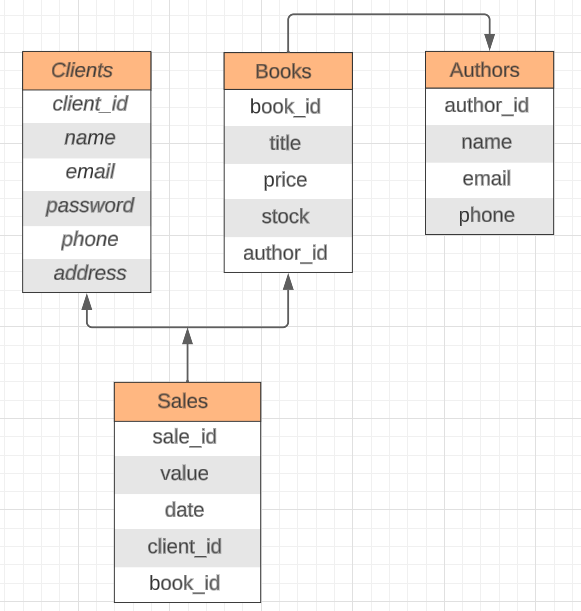

# Library API 📚✏️

Aplicação de estudos com a finalidade de simular uma API de uma livraria.

## 💻 Tecnologias utilizadas:
<div style="display: flex; align-items: center;">
    
    <span>Javascript</span>
</div>

<div style="display: flex; align-items: center;">
    
    <pan>Node.js</pan>
</div>

<div style="display: flex; align-items: center;">
        
        <span>Express.js</span>
</div>

<div style="display: flex; align-items: center;">
        
        <span>Express-basic-auth</span>
</div>

<div style="display: flex; align-items: center;">
        
        <span>Nodemon</span>
</div>

<div style="display: flex; align-items: center;">
    
    <span>CORS</span>
</div>

<div style="display: flex; align-items: center;">
    
    <span>Dotenv</span>
</div>

<div style="display: flex; align-items: center;">
    
    <span>Pg</span>
</div>

<div style="display: flex; align-items: center;">
    
    <span>ElephantSQL</span>
</div>

<div style="display: flex; align-items: center;">
    
    <span>Sequelize</span>
</div>

<div style="display: flex; align-items: center;">
    
    <span>Mongodb</span>
</div>

<div style="display: flex; align-items: center;">
    
    <span>Mongoose</span>
</div>

## 📕 Sobre o projeto
Resolução de um exercício proposto no bootcamp Node.js da instituição IGTI, foi utilizado um banco SQL e NOSQL, criação dos respectivos endpoints e autenticação de usuário.

## 👀 Observações
* O arquivo ```.env.example``` deve ser renomeado para ```.env``` e preenchido corretamente com a string de conexão.
* Para iniciar o projeto, execute o comando ```npm run dev```.

## 📊 Diagrama ER
